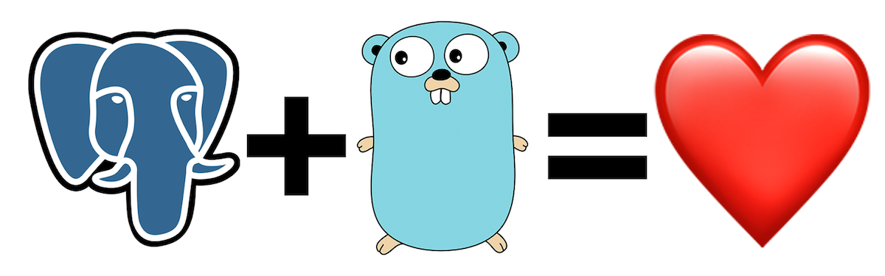

# How to use PostgreSQL with Go

SUMMARY: This article covers how to use PostgreSQL together with the programming language Golang (Go). After showing how to get started with Go’s Object Relational Mapper, it offers an example of setting up a PostgreSQL database using Go.

1. The connector

2. Getting started

3. A simple example

4. Launch!

Once Go is installed, you’ll need to install GORM and some of its dependencies:

<quote>
go get github.com/jinzhu/gorm

go get github.com/gorilla/mux

go get github.com/lib/pq

go get github.com/rs/cors
<quote>

$ curl localhost:8080/cars 
$ curl localhost:8080/cars/2 
$ curl -X DELETE localhost:8080/cars/2 
$ curl localhost:8080/drivers/1 | python -m json.tool 